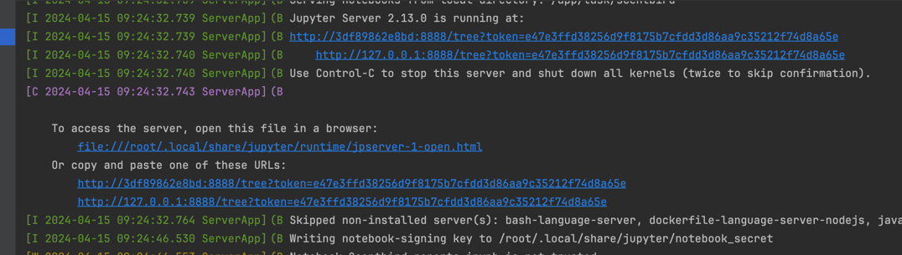

# Scentbird test task

## Run
- build docker image
- run docker container with ENV:
  - POSTGRES_HOST
  - POSTGRES_USER
  - POSTGRES_PASSWORD
- open Jupyter UI from the link in the container logs:
  
- Open *Scentbird_reports.ipynb* from the project root